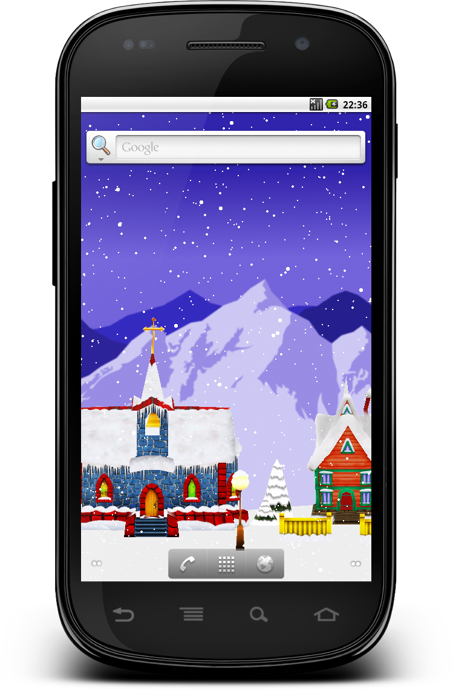
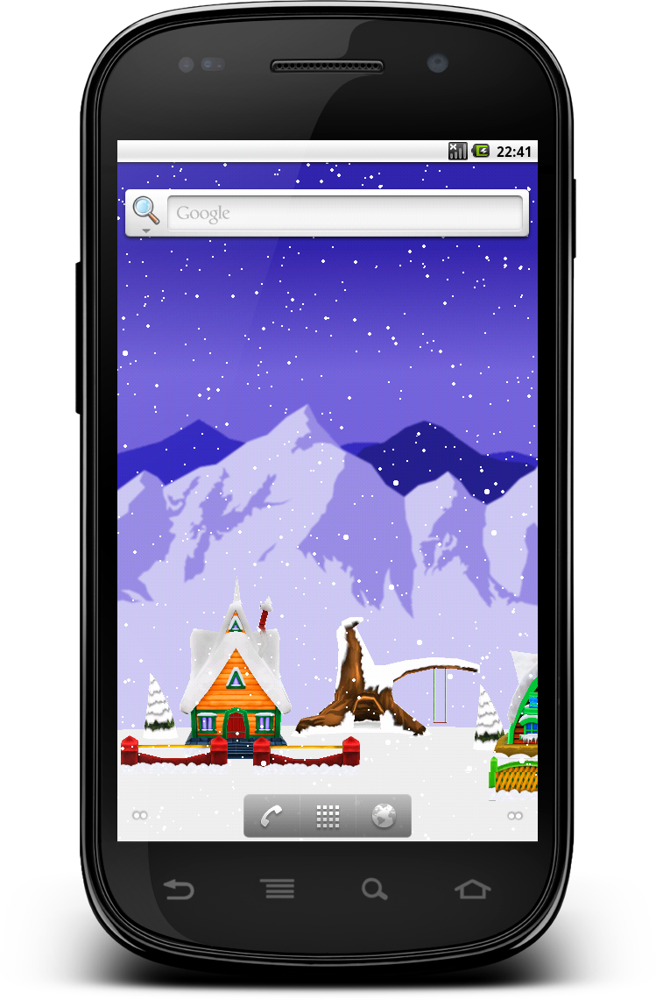
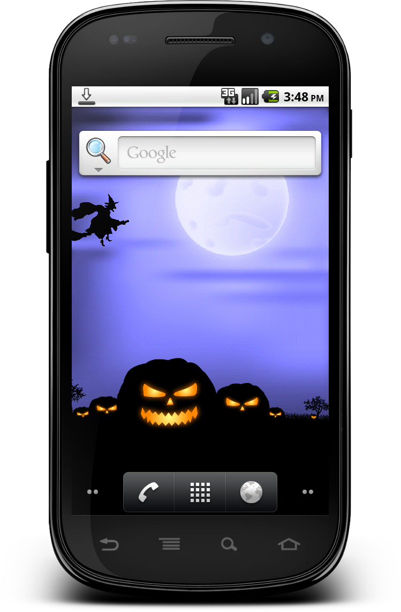
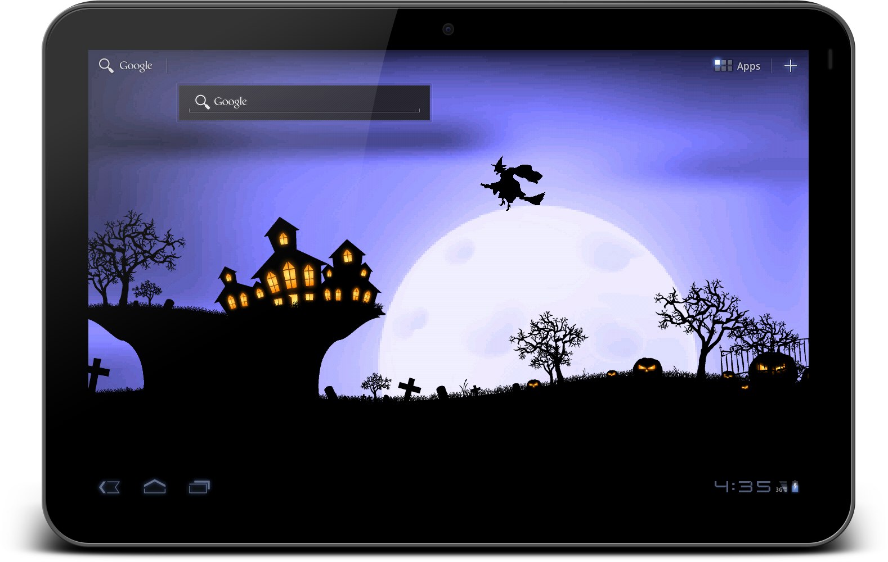

# Live-Wallpaper-Android
The is the base rendering engine used in my Android Live Wallpapers. 

## Inside you will find:

### Android Wallpaper Service
A example of setting up and working with an Android Live Wallpaper service

### Drawing to a canvas
Examples of drawning images and animaiton on to a basic canvas

### Sprite Animations
There is also a good example of code for playing sprite animations. This is where your artwork is broken into frames and you need to render them in a certain order to create animation. You can then play the animation forward, backward, in a loop, or ping pong it back and forth. This example also shows you how to play that animation at a given speed regardless of frame rate. 

### Double Buffering
The system uses double buffering to prevent the screen from flickering while it is being drawn. 

## Utilities
Several of the utilities used in this engine are not mine. I left the authors original comments and tags in place for credit.

## Screenshots
### Christmas Dreamscape

### Halloween Screamscape

